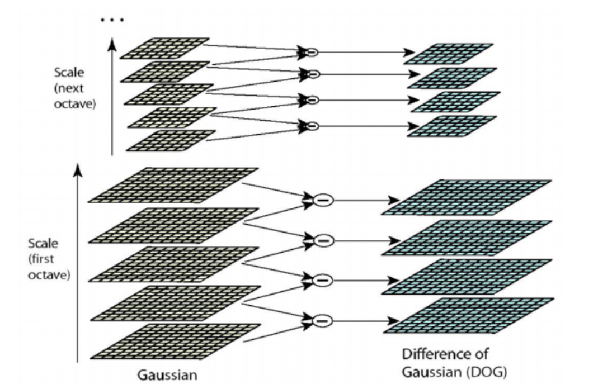
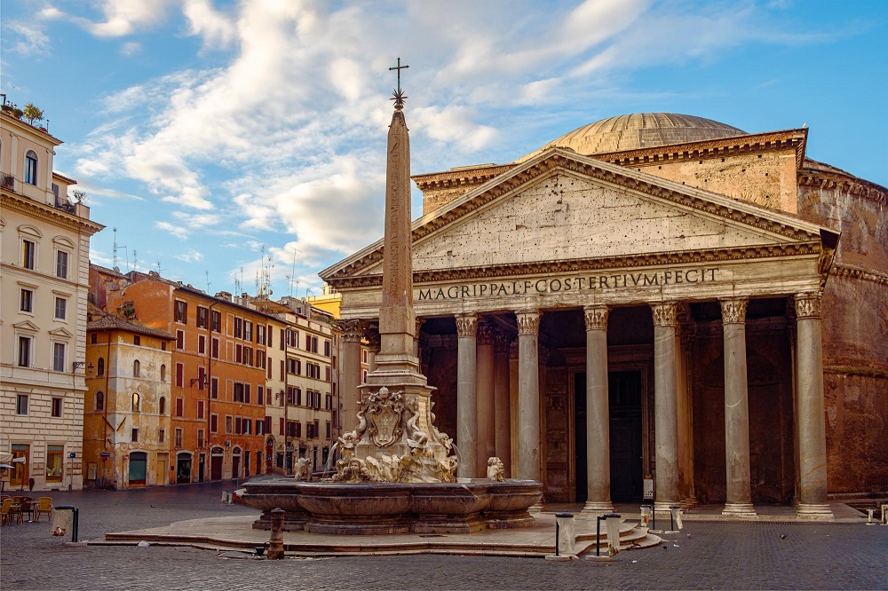
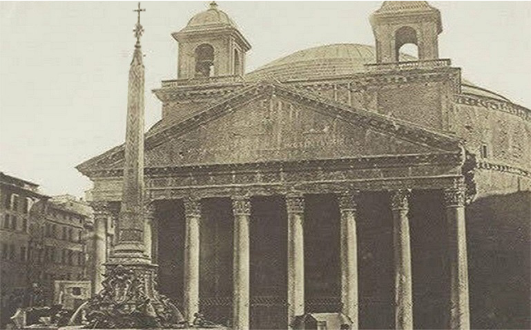
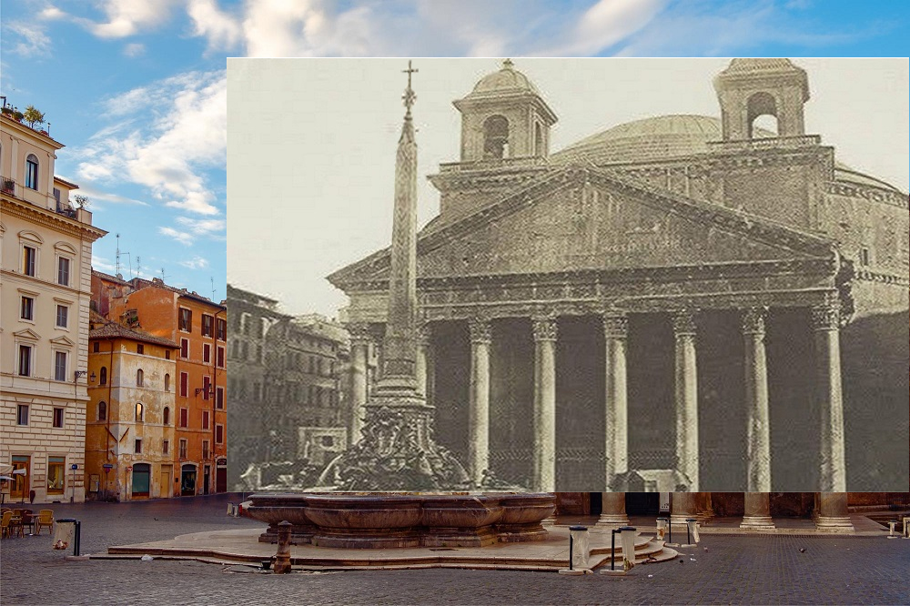
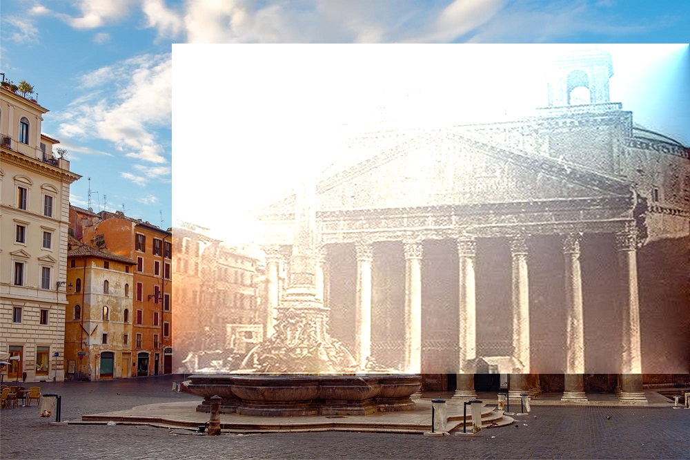
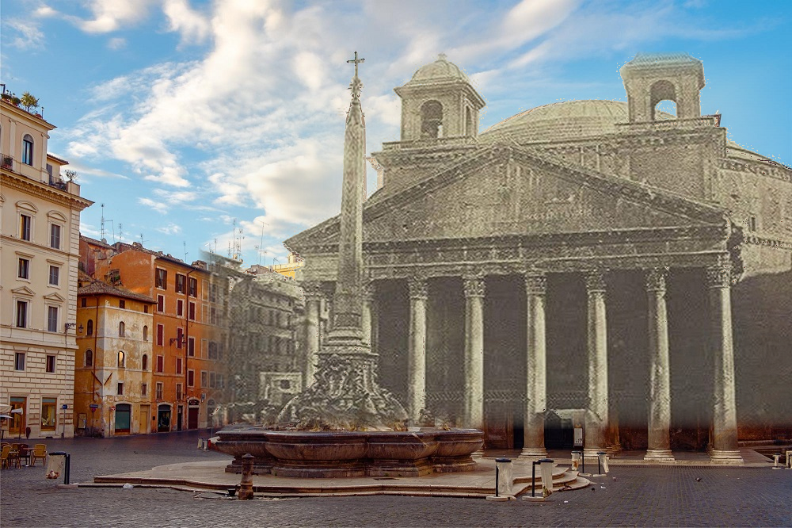
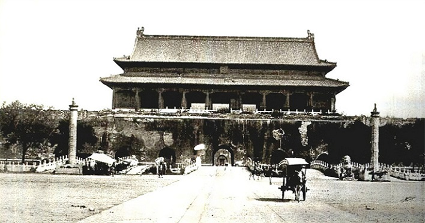
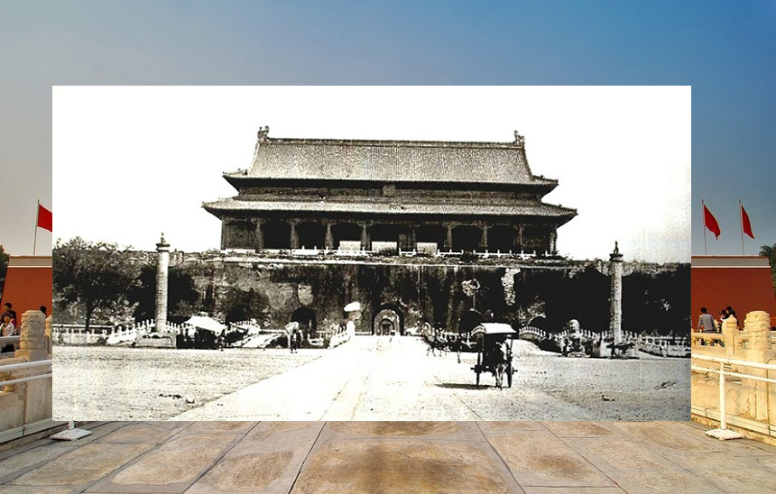
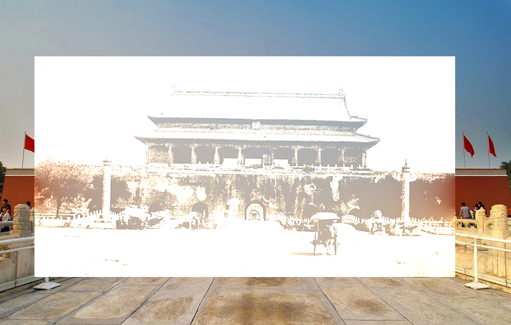
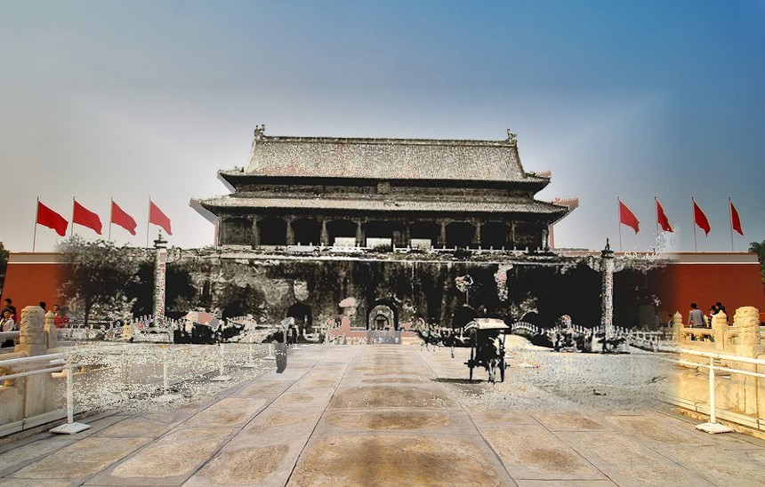

# 基于图像拼接和融合的Look Into the Past

成员及分工

- PB18061335许翰墨

  - 问题分析与设计
  - 测试样例搜集
  - coding
    - 实现图像特征点匹配
    - 实现图像前景和背景加权融合
  - 实验报告撰写

- PB18061279潘秋实

  - 问题分析与设计
  - coding
    - 实现图像泊松融合
  - 实验报告撰写

## 问题描述
我们的初衷是为了通过将新旧图片进行拼接和融合来追溯历史，对比历史上不同时期场景所发生的变化，静态的体现时光的流逝，达到一种艺术效果。

$Look\ Into\ the\ Past$就是实现上述功能的项目，在这个项目中我们将分别回溯$100$年前的罗马万神殿和北京天安门同今日所发生的区别。

将$Look\ Into\ the\ Past$问题转化为计算机视觉问题，其本质就是实现图片的匹配、拼接和融合，在本次任务中我们使用特征点匹配将旧照片(通常较小)嵌入到新照片中去(二者的scale是相同的)，其次，为了使结果更自然，我们对嵌入部分进行了融合。

## 原理分析

#### 特征点匹配

图像特征点匹配部分使用了$SIFT$(尺度不变特征变换)特征检测算法，主要目的是检测出两张图片中的特征点并进行良好匹配。

$SIFT$的基本思想是对图片进行不同程度的高斯模糊，得到处理过的图像金字塔，再做差分，对图像中的信息进行过滤，图示如下：



接下来的步骤是检测特征点，要求该点在尺度方向和图像内部均为极值点，即和同尺度的图像中该点周围$8$个点以及相邻尺度的图像中该点对应所在范围的$9*2=18$个点进行比较，判断是否为极大值点或极小值点。

最后还要确定特征点的方向，在它的一个邻域内统计其梯度方向直方图，选择最多的方向作为主方向，其次的方向作为辅方向，由此来进一步得到特征点的描述子。

#### 图像拼接

对新旧两张图片分别提取特征点描述子之后，进行匹配，之后计算旧图片相对于新图片的$homography$变换矩阵，最后将视角变换后的旧图片拼接到新图片的对应区域中去，得到结果图片。所谓的$homography$矩阵本质上就是两张图像上的匹配特征点对之间满足的几何关系，假设$x_1$为旧图像上的某个特征点的齐次坐标，而$x_2$为新图片上的对应特征点的齐次坐标，那么二者满足一个几何关系$x_2 = Hx_1$。$H$矩阵本质上是$H=R+\frac{1}{d}TN^T$，其中$R$为旋转矩阵，$T$为平移矩阵，$N$为特征点所在的平面的单位法线向量。$homography$矩阵可以使用四点法进行求解，但是其约束是四个点在空间中的同一个平面上，并且任意三者不共线。之所以使用$homography$矩阵进行变换而不是本征矩阵，一是考虑到实验场景主要为建筑物，其中存在着较多的平面，那么使用$RANSAC$方法有较大的几率可以使得采样到的四个特征点在同一个平面上，二是因为考虑到计算本征矩阵需要八点法，而新旧图片之间存在着较大的纹理区别，很难保证得到足够数量的良好匹配点对。事实上，在实验过程中如果不使用人工筛选，我们甚至连四对良好匹配的特征点对都无法得到(程序无法自动判断得到的匹配点对是否是正确的)。在实际实验中我们发现可以通过调参来保证距离最小的那对特征匹配点对是正确匹配的，所以实验中只能计算平移矩阵，拼接的时候也就没有进行任何视角变换。

#### 图像融合

图像融合有两种策略，一种是对新旧图片对应像素点的像素值取加权平均融合，权重系数由像素点离边界的位置决定，距离拼接区域边界越远的点，其对应的旧图片的权重应该越大，而新图片的权重应该越小。但是实际操作中发现因为新旧图片中均存在前景和背景差距较大的问题，如果只是简单对图像进行羽化的话，效果并不好，所以之后选择对新旧图片的前景和背景融合进行额外分开处理。在前面羽化的基础上，当像素点为旧图片前景时，适当减小其权重，并加大新图片的权重。至于图像的前景和背景怎么区分，没有很好的自动方法，比较理想的方式是使用$Graph\ Cut$进行前景和背景的分割，但是这样我们需要人为的给出前景的先验，但是我们并不打算制作实时交互的内容，所以最后采用一个比较$Naive$的方法，即根据图像灰度值的大小进行简单判断，因为我们认为需要特殊对待的就图像背景基本上都是天空等灰度接近白色的区域，其和前景之间的灰度值差距较大，所以可以简单暴力的设置一个灰度阈值来进行自动分割。

另一种是泊松融合，其希望保持老图片内部的图像梯度在拼接到新图片上时发生尽可能小的变化，我们可以通过对旧图片各个像素点求散度，再将融合图片中拼接边界区域的像素值赋值为新图片的像素值，之后设置融合图片中拼接区域内部的像素值为未知数，约束这些未知像素值计算得到图像散度与老图片中对应点的散度尽可能相等，这样就得到了一个很稀疏的泊松方程组，对其进行求解即可得到融合结果。

## 代码实现

1.特征点提取与匹配部分，主要调用$OpenCV$库中的$SIFT$类实现，具体代码如下所示(为了防止贴的代码过长，后续部分内容使用了一些伪代码):

```c++
void ImageStitcher::FeaturePointMap()
{
    //设置SIFT所用的相关数据结构(不同的输入图片参数可能需要微调)
    auto sift_detector_ = cv::SIFT::create(0, 3, 0.12, 7, 2.8);
    std::vector<cv::KeyPoint> keypoint_list_c_, keypoint_list_p_;                                
    cv::Mat descriptor_c_, descriptor_p_;
    cv::FlannBasedMatcher point_matcher_;
    //匹配良好的特征点对列表      
    std::vector<cv::DMatch> well_matched_point_list_;                       	
    cv::Mat image_match_;
    //新图像和旧图像的灰度图
    cvtColor(image_c_, image_gray_c_, cv::COLOR_RGB2GRAY);                                       
    cvtColor(image_p_, image_gray_p_, cv::COLOR_RGB2GRAY);                                     
    //新图像和旧图像的特征点描述子
    sift_detector_->detectAndCompute(image_gray_c_, cv::Mat(), keypoint_list_c_, descriptor_c_);      
    sift_detector_->detectAndCompute(image_gray_p_, cv::Mat(),keypoint_list_p_, descriptor_p_); 
    //特征描述子匹配
    point_matcher_.match(descriptor_p_, descriptor_c_, well_matched_point_list_);
    //根据匹配良好程度降序排序并只选择匹配最良好的那一对特征点对
    std::sort(well_matched_point_list_.begin(), well_matched_point_list_.end());
    well_matched_point_list_.resize(1);
}
```

2.图像拼接部分，主要根据匹配最良好的匹配点计算出旧图像上的匹配点到新图像上的匹配点的平移矩阵(因为良好匹配点对数量太少，所以计算出正确的$Homography$矩阵)，具体代码如下所示:

```c++
void ImageStitcher::ImageAlignment()
{
    //过去图像到当前图像的变换矩阵(大小3*3)
    cv::Mat homography_matrix_;     
    //因为良好匹配的特征点数量很少，算不出投影矩阵，这里用平移矩阵代替
    homography_matrix_ = (cv::Mat_<double>(3, 3) << 1, 0, (int)(feature_point_list_c_[0].x - feature_point_list_p_[0].x), 0, 1, (int)(feature_point_list_c_[0].y - feature_point_list_p_[0].y), 0, 0, 1.0);
    //实际上应该用findHomography函数采样计算得到
    //homography_matrix_ = findHomography(feature_point_list_p_, feature_point_list_c_, cv::RANSAC);
    //计算过去图像的四个顶点变换后的坐标
    corner_transform_list_p_ = CornerTransform(image_p_, homography_matrix_); 
    //图像配准  
    warpPerspective(image_p_, image_transform_p_, homography_matrix_, cv::Size(image_c_.cols, image_c_.rows));
}
```

3.图像融合中，前景和背景分别进行加权平均融合的主要代码如下所示(对于求出了正确的$homography$矩阵的旧图像，其变化之后不再是矩形，需要使用扫描线算法来对其进行光栅化，判断新图像对应融合区域有哪些像素点存在于变换后的旧图像的内部，但是因为使用平移矩阵代替了$homography$矩阵，旧图像仍然是矩形，所以这一步可以省略):

```c++
//设置最终融合得到的图像
fused_image_ = cv::Mat::zeros(image_c_.rows, image_c_.cols, CV_8UC3);      
//使用扫描线算法对变换后的旧图像进行光栅化 
// ScanLine scanline_ = ScanLine(corner_transform_list_p_);
//新图像像素的权重
double weight_;
//拼接区域的中心坐标
cv::Point2i center_transform_p_;
center_transform_p_.x = (int)((MIN(image_c_.cols, corner_transform_list_p_[3].x) + MAX(0, corner_transform_list_p_[0].x)) / 2);
center_transform_p_.y = (int)((MIN(image_c_.rows, corner_transform_list_p_[3].y) + MAX(0, corner_transform_list_p_[0].y)) / 2);
//先将新图片粘贴到目标融合图像上
image_c_.copyTo(fused_image_(cv::Rect(0, 0, image_c_.cols, image_c_.rows)));
//对于旧图片中应该粘贴到融合图像上的每个像素(有部分像素可能超出边界需要去掉)
//计算其距离图像中心坐标的距离,赋予一个权重
for (size_t i = MAX(0, corner_transform_list_p_[0].y), max_row = MIN(image_c_.rows, corner_transform_list_p_[3].y); i < max_row; i++)
{
	for(size_t j = MAX(0, corner_transform_list_p_[0].x), max_col = MIN(image_c_.cols, corner_transform_list_p_[3].x);j < max_col; j++)
    {
		//计算距离中心坐标的距离
        cv::Point2d center_distance_, max_center_distance_;
        center_distance_ = cv::Point2d(std::abs(center_transform_p_.x - (int)j), std::abs(center_transform_p_.y - (int)i));
        //计算拼接区域边缘的点距离中心坐标的距离
        max_center_distance_ = cv::Point2d(center_transform_p_.x - MAX(1, corner_transform_list_p_[0].x), center_transform_p_.y - MAX(1, corner_transform_list_p_[0].y));
		//计算权重
        weight_ = MAX(center_distance_.x / max_center_distance_.x, center_distance_.y / max_center_distance_.y);
        //如果像素点根据灰度阈值判断为背景
        if (image_gray_transform_p_.at<uchar>(i, j) >= 210)
        {
            weight_ = std::pow(weight_, 1); 
        }
        else
        {
            weight_ = std::pow(weight_, 7); 
        }                 
        //像素点融合
        fused_image_.at<cv::Vec3b>(i, j) = weight_ * image_c_.at<cv::Vec3b>(i, j) + (1 - weight_) * image_transform_p_.at<cv::Vec3b>(i, j);
    }
}
```

在此基础上我们对拼接区域出现在新图片边缘的情况进行了一些特殊处理，降低其羽化效果，如下所示(为了避免重复，这里就只显示了处理左边缘过度羽化的情况):

```c++
//判断拼接区域是否距离新图片的边缘太近(pixel_num_ = 40)
if (MAX(0, corner_transform_list_p_[0].x) < pixel_num_)
{
    //遍历拼接区域中处于此区域的像素点
    for (size_t i = MAX(0, corner_transform_list_p_[0].x); i < pixel_num_; i++)
    {
        for (size_t j = 0; j < edge_pixel_weight_[0].size(); j++)
        {
            size_t row_index_ = j + MAX(0, corner_transform_list_p_[0].y);
            //如果判断为背景,忽略过度羽化的问题
            if (image_gray_transform_p_.at<uchar>(row_index_, i) >= 210)
            {
                continue;
            }
            //否则设置新图像融合权重为距离边缘40像素点处的权重
            weight_ = edge_pixel_weight_[0][j];
            fused_image_.at<cv::Vec3b>(row_index_, i) = weight_ * image_c_.at<cv::Vec3b>(row_index_, i) + (1 - weight_) * image_transform_p_.at<cv::Vec3b>(row_index_, i);
        }
    }
}
```

4.图像融合部分，泊松融合的部分实现的主体如下所示:

```c++
cv::Mat PoissonFusion::GetFusion()
{
	cv::Mat result = target.clone();
    //获得旧图像中需要融合的像素点的下标
	GenIndex();
    //构造稀疏系数矩阵A
	GenCoefMatA();		
    //为了加速对稀疏稀疏矩阵进行预分解
	PreFactorizeA();
    //构造图像散度值向量b
	GenVecb(mixed_grad);
    //设置融合后的图像中对应像素点的值为未知数	
	Eigen::MatrixXd X;
    //用Eigen库中的SimplicialLLT方法求解稀疏线性方程组
	X = solver.solve(vec_b);
    //后续将解赋值给融合图像即可,篇幅原因这里不显示这部分代码
}
```


## 效果展示

#### 测试样例1(罗马万神殿)

- 新图片
  
- 旧图片
  
- 不融合直接拼接结果

- 泊松融合结果

- 前景和背景区分加权融合结果


#### 测试样例2(北京天安门)

- 新图片
  
- 旧图片
  
- 不融合直接拼接结果

- 泊松融合结果

- 前景和背景区分加权融合结果


#### 对运行结果的简单分析

可以看出使用前景和背景分别加权融合的方式得到的效果挺好，但是使用泊松融合的方式得到的效果不尽人意，我们认为主要原因是泊松融合主要做的是老图片前景对新图片背景的融合，但是在上面两个测试样例中，老照片黏贴到新图片上后，其周围区域同时含有了新图片的前景和背景，这导致融合效果不好，所以不推荐使用泊松融合进行$Look\ Into\ the\ Past$问题的求解。

## 工程结构

```
.
|-- src
|   |-- App
|   |   |-- CMakeLists.txt(CMake配置文件)
|   |   |-- imagegrad.h(计算图像梯度)
|   |   |-- imagegrad.cpp(计算图像梯度)
|   |   |-- imagestitch.h(图像匹配和拼接)
|   |   |-- imagestitch.cpp(图像匹配和拼接)
|   |   |-- poissonfusion.h(泊松融合)
|   |   |-- poissonfusion.cpp(泊松融合)
|   |   |-- scanline.h(扫描线)
|   |   |-- scanline.cpp(扫描线)
|   |   |-- main.cpp(主函数)
|-- test
|-- |-- 1(罗马万神殿相关测试图片和结果)
|   |   |-- current.jpg(新图片)
|   |   |-- past.jpg(旧图片)
|   |   |-- FusionResult_NONE.png(无融合)
|   |   |-- FusionResult_WEIGHT_AVG.png(前景背景分别加权融合)
|   |   |-- FusionResult_POISSON.png(泊松融合)
|-- |-- 2(北京天安门相关测试图片和结果)
|   |   |-- current.jpg(新图片)
|   |   |-- past.jpg(旧图片)
|   |   |-- FusionResult_NONE.png(无融合)
|   |   |-- FusionResult_WEIGHT_AVG.png(前景背景分别加权融合)
|   |   |-- FusionResult_POISSON.png(泊松融合)
|-- out
|-- |-- build
|-- |-- |-- Release
|-- |-- |-- |-- lookintopast.exe(可执行程序)
|-- README.md(实验报告)
|-- SIFT.png(实验报告中的插图)

```

## 运行说明

#### 所使用的库版本:

```
opencv(C++)==4.5.1
eigen(C++)==3.3.7
```

#### 运行说明

已经在$./out/build/Release$文件夹中给出了可执行文件与动态链接库，下载后直接在$cmd$中执行即可，其中$test\_ case$是测试样例的下标(可选择$1$或$2$)，$fusion\_ method$是融合方法，可选择为$NONE$、$POISSON$和$WEIGHT\_ AVG$:

```
lookintopast.exe test_case fusion_method
lookintopast.exe 1 NONE
lookintopast.exe 1 POISSON
lookintopast.exe 1 WEIGHT_AVG
lookintopast.exe 2 NONE
lookintopast.exe 2 POISSON
lookintopast.exe 2 WEIGHT_AVG
```

如果想要测试其他样例，需要在$./test$文件夹下建立新序号的文件夹(比如$3$)，然后将新旧照片分别命名为$current.jpg$和$past.jpg$，之后同上进行相同的输入测试即可。
